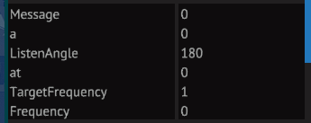
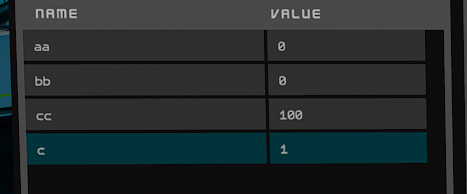
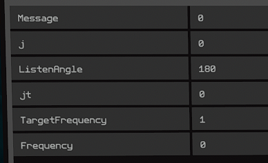
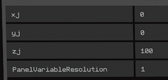
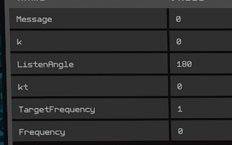
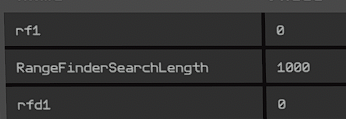
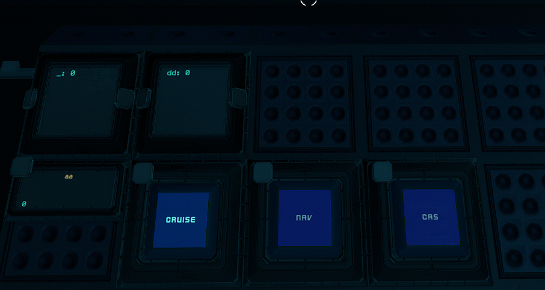
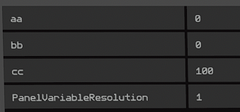

# sb-projects
starbase yolol projects and ship designs

See the wiki.

https://github.com/fixerid/sb-projects/wiki/Navigation-Autopilot-with-Collision-Avoidance-System-(NavCas)

Copied below:

As a disclaimer I am an amateur coder at best and this is just my attempt at documentation for my autopilot system based on vector comparison for the starbase community.

# Concept

The Navigation Autopilot with Collision Avoidance System (NavCas) uses [ISAN](https://github.com/Collective-SB/ISAN)'s coordinate system to determine ship vectors in relation to a target vector determined by target coordinates. Following proper setup the system will guide a ship to a set of coordinates determined by the user with maneuvering protocols in place to avoid asteroid collisions.

# Design and Requirements

Below is a numbered image of the basic setup:
1. 3 Navigation Receivers including hardpoints
2. 3 ISAN Mono Yolol Basic or Advanced Chip setups with associated progress panels to share respective xyz coordinates
3. Autopilot Yolol Advanced Chip setup
4. Collision Avoidance System Basic or Advanced Chip Setup
5. Range Finder setup
6. Control System and Informative Panels

I have also included a [blueprint](NavCas/NavCas.fbe) with the module viewed below. The blueprint has the scripts preloaded on the chips. 

There is also a blueprint for a [demo shuttle](NavCas/NavCas_shuttle.fbe) as a functional demo. Keep in mind the accuracy of the shuttle will be pretty low due to the way the vectors are calculated, larger ships will fair better. But it should give you a good idea of how the system works. 

Please also check the repository for the most updated versions. If you copy the yolol chips from this blueprint note that the default values have been customized for a small ship and the pitch is asymmetrical with line 16 on the autopilot yolol script customized to account for that (:pch=-pt **_/5_**).

# Setup

The easiest way would be to import this [blueprint](NavCas/NavCas.fbe) then either create a module to add to your own designs or "buy current ship" from the ship designer menu and then pilot your current ship to the ship designer workspace and modify manually.

## Navigation Receivers and ISAN modification

The three navigation receivers must be in a single plane from the front to back and then below. The two top receivers must be on the same level respective to the ship. And then 2 back receivers must be vertical respective to the ship. Think an "L" facing downwards. 

Set the front receiver, ISAN code, and progress panel as below:

Note: the "c" field is used for autopilot and collision avoidance communication.

[Yolol ISAN code for front receiver](NavCas/yolol_ISAN_front)

Back receiver:

[Yolol ISAN code for back receiver](NavCas/yolol_ISAN_back)

Bottom receiver:

[Yolol ISAN code for bottom receiver](NavCas/yolol_ISAN_below)

## Autopilot and Collision Avoidance Yolol Scripts

Enter the [autopilot](NavCas/yolol_nav) and [collision avoidance](NavCas/yolol_cas) script into their respective yolol chips.

## Rangefinders

Setup rangefinders and associated hardpoints as below.

## Button and Panel Setup

* text panel "_" for ISAN
* text panel "dd" for autopilot debugging (optional)
* progress bar "aa" for target coordinates
* hybrid button "nav" for autopilot
* hybrid button "cas" for collision avoidance system
* hybrid button "cruise" for cruise control (recommended or manually set fwd levercenteringspeed to 0)

## Flight Variables

Change the following flight variables in your flight control unit and in your levers. Don't forget to update your hotkeys using "v" while in the pilot's seat.

* FCUForward = fwd
* FCURotationalYaw = yaw
* FCURotationalPitch = pch

# First Flight

Once you have setup the above, operation is simple. Aim at the "aa" progress panel, press "u", go to the "Data" tab, and input your xyz coordinates into the aa, bb, cc fields respectively. Have a cruise function enabled or set your forward lever centering speed to 0. Otherwise the system will only align your ship. Press the "Nav" button. 

# System Details

Once the navigation system is enabled, it will automatically turn on the collision avoidance system and start aligning with the target destination. Once aligned it with proceed at full throttle unless the collision avoidance system detects and obstacle and the ship with pitch down until the rangefinders no longer detect.

The mechanics of the system relies on the 3 navigation receivers to determine ship orientation relative to the target destination and then tries to orientate the ship with the destination. Then if the distance to target at any point during the journey exceeds the projected journey length by a certain threshold the system will stop the ship to re-orientate before continuing. This is because ISAN system is great for determining accurate positional information while stationary but exceedingly becomes less reliable when in motion. Per their [documentation](https://isan.to/isan.pdf) Mono mode while stationary provides the best accuracy to within 1 meter.

Broken down into steps:

1. Distance to target calculated from rear receiver
2. Distance from rear to front receiver calculated (ship length)
3. Calculate ship length along a line from rear receiver to target destination (give xyz where front receiver should orientate)
4. Calculate vectors for front receiver to targeted orientation and from rear receiver to bottom receiver
5. Calculate dot product of prior two vectors which determine vertical or pitch orientation
6. Calculate vector from rear receiver to front receiver
7. Calculate cross product of the two ship vectors to determine a horizontal vector
8. Calculate dot product of the ship's horizontal vector and the target vector to determine horizontal or yaw orientation

9. Pitch and Yaw until orientated within threshold to destination
10. Full send
11. Calculate variance with expected distance to destination during journey if past threshold stop and re-orientate

# Troubleshooting

Make sure you have the text panel "dd" placed, this is the debug panel. The lines are as follows:

## Debug Panel

1. Optimal distance to destination (calculated from start)
2. Calculated distance to destination
3. velocity (approx m/3s)
4. pj (vertical alignment/dot product, goes to 0 when vertically aligned)
5. px (horizontal alignment/dot product, goes to 0 when horizontally aligned)
6. r (threshold +/- that pj/px have to get within 0 to accelerate)
7. g (if 1 pj and px have aligned and ship will accelerate)

## Script Settings

Additionally, on the autopilot nav script the variable on `line 2` are as follows:

* r: vector alignment threshold (n)
* pt: pitch adjustment (1-100) recommend <10 otherwise too large movements make the vectors inaccurate and will need larger threshold
* yt: yaw adjustment (1-100) same as above
* ep: percentage increase to expected distance as a threshold before stopping to correct course (>1.%%)
* ed: flat distance increase for threshold before correcting (# in meters)
* et: distance to target to stop autopilot

## Frequently Asked Questions

### Why does my ship only pitch or yaw and never takes off?
Check if pj and px are both +/- r (default is 40) at any point. If not then the ship keeps over shooting the preferred orientation.
1. `Increase r on line 2`
2. `If pj doesn't get within threshold decrease pt on line 2`
3. `If px doesn't get within threshold decrease yt on line 2`

Alternatively you may need to increase pt or ytif it does not pitch or yaw enough. 

### Why does my ship keep stopping frequently to re-orientate?
Do the opposite of the question just previous to get a more precise orientation. But if overshooting is an issue then you will need to change the re-orientation threshold.

`On line 2 increase ep or ed`

This line states that the threshold is 5% (as 1.05) plus 5000 meters by default.

### Why does my ship orientate to the destination but never takes off? 
First check if the cruise function is on or if when you manually accelerate it doesn't stop.

### Why do my buttons not stay pressed?
Check that the button style is set to 1.

### How come my ship isn't perfectly aligned with the transponder's destination?
This is one of the limitations of our current methods of getting positional data with ISAN. Don't worry that's why there is a re-orientation feature that is programmed to get you within 5000 meters. 

`On line 2 you can decrease et to get closer to the destination`

### Why is my ship completely off with the destination?
Sometimes the accuracy can be greatly off due to a number of factors. Most of the time the system takes a few cycles of pitching and yawing to get accurate vectors. If it is still off there may be an issue with your ISAN configuration or there are certain coordinates in my testing that were off. This was a very infrequent occurrence which usually self corrected before take off.

`You can fly and try again at another coordinates or if the system accelerates the ship it will correct itself once the threshold has been met.`

`However if your destination is far away the 5% + 5000m can be substantial before it corrects`

`Otherwise if you did not use the blueprint to import the module and did it with manual copy pasting, I would recommend using the blueprint. There's less chance of transcription and setup errors that way.`

### Why do you use progress panels for variables, can I use a memory chip instead?
Yes. I originally wanted to keep the tech requirements as low as possible for accessibility and in case there is a tech tree reset at some point.

### I followed every instruction above and went through every troubleshooting question and still can't get the system to work!

#1 and #2 errors are copy/paste and missed cable connections. Using the blueprint avoids copy/paste errors with the yolol codes and custom field names. But you may still check the field names if working in the ship designer as it is very easy to accidentally add extra characters while trying to change the camera view. 

A quick tip for checking cable connection errors is to look to the xa, xj, xk progress panels that store the coordinates for the navigation receivers. Put the ship in motion with cruise control on then press "u" and check the values of each panel, all should be updating about every second. If they are not then there is a connection issue between the specific progress panel, the related navigation receiver, and/or the yolol chipset. I would recommend checking the cabling, the name fields, and possibly the yolol code in case an extra character snuck in during setup.

### Also remember this system is bound to the limitations of ISAN, so further than 900-1000km from origin will cause it to become faulty. Also in test mode the z and y coordinates will be reversed.

# Support

Contact me via Fixerid in game or fixerid on reddit. In game tips appreciated.

This project is intended to be a functional prototype feel free to improve it and/or clean up the code.

